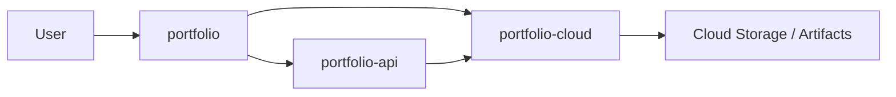

# Portfolio Platform

[🇬🇧 English](README.md) | [🇪🇸 Español](README.es.md)

Portfolio Platform documenta cómo funciona el portfolio como sistema de producto, no solo como sitio web: contenido editorial estático, una API runtime deliberadamente acotada y workflows cloud que automatizan releases y operaciones de suscriptores.

## Repositorios de Código

- [`portfolio`](https://github.com/matigaleanodev/portfolio) -> frontend Angular standalone y blog
- [`portfolio-api`](https://github.com/matigaleanodev/portfolio-api) -> API NestJS para contacto, chat y fachada de suscripciones
- [`portfolio-cloud`](https://github.com/matigaleanodev/portfolio-cloud) -> servicios serverless en AWS para automatizacion de releases y ownership de suscripciones

## Por Qué Existe Este Repo

Este repositorio existe para mostrar el límite del sistema entre contenido, comportamiento runtime y automatización cloud.

Si abrís los repos de código por separado, cada uno se entiende. Lo que agrega este repo es la razón de más alto nivel: por qué el sitio es static-first, por qué la API se mantiene intencionalmente pequeña y por qué los workflows de release y suscripciones viven fuera del frontend.

## Foco Actual

- mantener el contenido editorial versionado en el repo frontend
- mantener el backend runtime chico y explícito
- hacer que la automatización cloud sea dueña de los workflows de releases y suscriptores
- documentar los contratos entre repos con suficiente claridad para poder evolucionarlos sin romperlos

## Arquitectura

## Docs

- [Overview](docs/01-overview.md)
- [Architecture](docs/02-architecture.md)
- [Roadmap](docs/03-roadmap.md)
