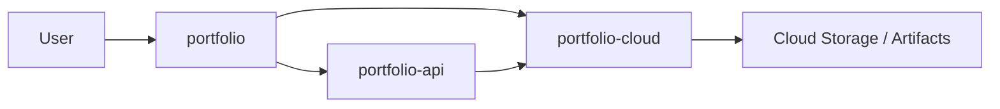

# Portfolio Platform

[🇬🇧 English](README.md) | [🇪🇸 Español](README.es.md)

Portfolio Platform documents how the portfolio works as a product system, not just as a website: static editorial content, a deliberately narrow runtime API, and cloud workflows that automate release and subscriber operations.

## Code Repositories

- [`portfolio`](https://github.com/matigaleanodev/portfolio) -> Angular standalone frontend and blog
- [`portfolio-api`](https://github.com/matigaleanodev/portfolio-api) -> NestJS API for contact, chat, and subscriptions facade
- [`portfolio-cloud`](https://github.com/matigaleanodev/portfolio-cloud) -> AWS serverless services for release automation and subscription ownership

## Why This Repo Exists

This repository exists to show the system boundary between content, runtime behavior, and cloud-owned automation.

If you open the code repositories independently, each one is understandable. What this repo adds is the higher-level rationale: why the site is static-first, why the API stays intentionally small, and why release and subscription workflows live outside the frontend.

## Current Focus

- keep editorial content versioned in the frontend repository
- keep runtime backend scope narrow and explicit
- make cloud automation the owner of release and subscriber workflows
- document the contracts between repositories clearly enough to evolve them safely

## Architecture

## Docs

- [Overview](docs/01-overview.md)
- [Architecture](docs/02-architecture.md)
- [Roadmap](docs/03-roadmap.md)
